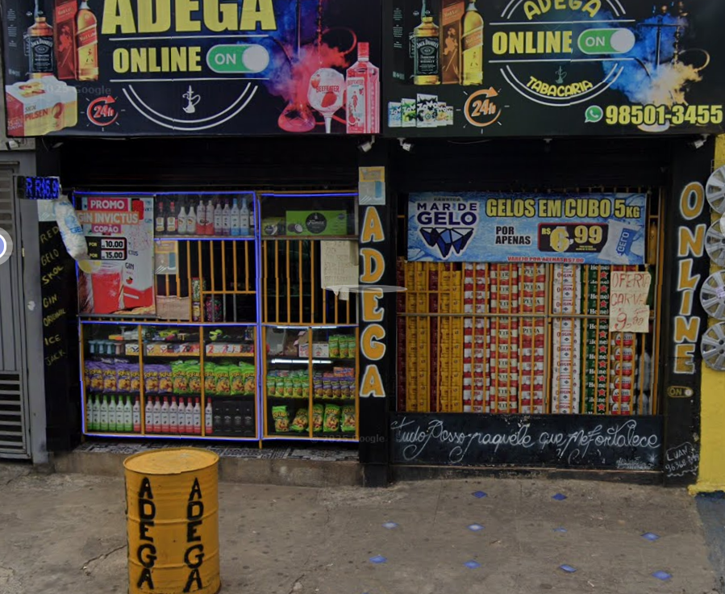
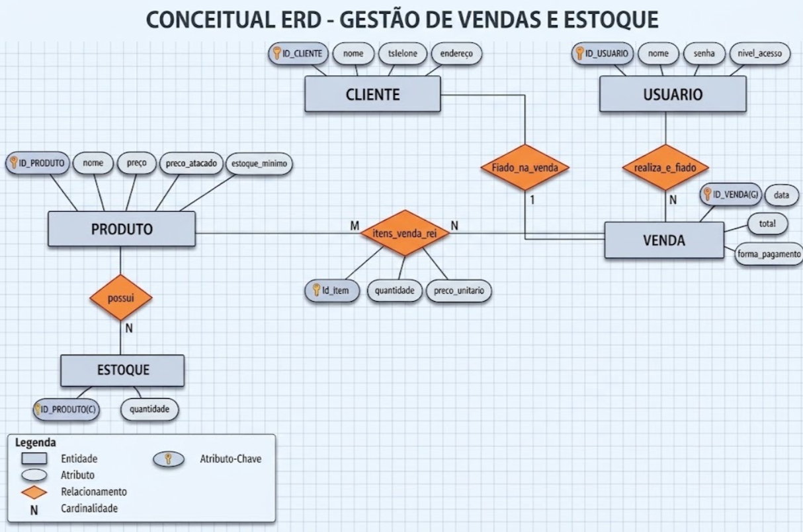

# Adega Online — Gestão de Vendas e Estoque

Sistema de automação comercial e gestão de dados desenvolvido para apoiar as operações de uma organização real que atua nos segmentos de adega e tabacaria.

O projeto tem como foco centralizar o cadastro de produtos, o controle de estoque, o registro de vendas, o gerenciamento de clientes que realizam compras a prazo ("fiado") e o acompanhamento das operações realizadas pelos usuários do sistema.

---

## Metadados

### Integrantes

| Nome | RGM |
|---|---:|
| Denner | 4733816 |
| Guilherme Schiavinato | 47769068 |
| Gustavo Castro | 47353716 |
| Juan Craveiro | 45005273 |
| Victor Silva | 47787945 |

---

# 1. Caracterização da Organização

## Nome e natureza da organização

A organização escolhida para o desenvolvimento do projeto é a **Adega Online**, um estabelecimento comercial privado e com fins lucrativos que atua conjuntamente nos segmentos de **adega e tabacaria**.

O grupo possui acesso direto à organização para realização da pesquisa de campo, pois um dos integrantes da equipe é colaborador do local. Essa condição possibilitou observar a operação e levantar informações relacionadas aos processos reais do estabelecimento.

## Contexto e porte

A operação possui uma equipe enxuta de aproximadamente **4 colaboradores**. Apesar do número reduzido de funcionários, o estabelecimento apresenta alta rotatividade operacional, com volume de vendas e movimentação contínua de mercadorias.

Também existe a gestão de contas de crédito interno, popularmente chamadas de **"fiado"**, utilizadas por clientes recorrentes.

## Problemas e necessidades identificados

Durante o levantamento foram identificados problemas relacionados principalmente à falta de centralização e automatização dos processos:

- **Desorganização do estoque:** dificuldade de manter um controle rigoroso sobre entradas e saídas de mercadorias.
- **Vendas fragmentadas:** ausência de integração adequada entre vendas e controle financeiro.
- **Gestão de fiados:** controle descentralizado de clientes devedores e valores em aberto.
- **Desalinhamento operacional:** dificuldade de acompanhar se os procedimentos de registro e controle estão sendo seguidos corretamente.
- **Risco de perdas e divergências:** maior possibilidade de erros humanos, esquecimentos e divergências no controle financeiro e de mercadorias.

## Justificativa da escolha

A Adega Online foi escolhida por dois motivos principais.

Primeiramente, existe acesso direto à organização por meio de um integrante do grupo que trabalha no local, facilitando a pesquisa de campo e o levantamento dos requisitos.

Além disso, a organização apresenta processos suficientemente diversificados para a aplicação dos conceitos de modelagem de dados, envolvendo produtos, estoque, vendas, clientes, crédito interno e usuários.

## Evidências da organização

**Nome fantasia:** Adega Online  
**Endereço:** Rua Dona Eloá do Vale Quadros, nº 17  
**Telefone:** (11) 98501-3455

O grupo realizou levantamento de campo e possui registros fotográficos da organização.

### Registro da organização



### Registro relacionado à pesquisa de campo


> **Observação:** as imagens acima devem ser colocadas no repositório nas pastas indicadas, utilizando os nomes de arquivo correspondentes.

---

# 2. Processos de Negócio

A operação da Adega Online está estruturada em torno de rotinas comerciais essenciais para o atendimento, controle financeiro e gerenciamento das mercadorias.

## Principais processos mapeados

### Cadastro de Produtos

Registro dos itens comercializados, incluindo informações como descrição, preço e dados necessários para o controle dos produtos.

### Controle de Estoque

Monitoramento da quantidade de produtos disponíveis nas prateleiras e no depósito, permitindo acompanhar as saídas e auxiliar na reposição.

### Cadastro de Clientes — Fiado

Gerenciamento dos clientes autorizados a realizar compras a prazo, mantendo informações relacionadas aos débitos e ao histórico de consumo.

### Realização de Vendas

Registro dos produtos solicitados pelo cliente, processamento do pagamento — incluindo a modalidade de fiado — e finalização do atendimento.

### Abertura e Fechamento de Caixa

Rotina de controle dos valores movimentados durante o período de operação, incluindo abertura do caixa, entradas e conferência do valor final.

## Fluxo operacional atual

O levantamento realizado identificou um fluxo de venda composto, de forma geral, pelas seguintes etapas:

1. **Atendimento:** o cliente chega ao estabelecimento e é atendido pelo funcionário.
2. **Operação e registro:** o funcionário realiza a venda e processa o pagamento ou registra a modalidade de fiado.
3. **Armazenamento:** os dados da operação são registrados.
4. **Gestão e monitoramento:** posteriormente, o responsável pode consultar os dados para conferência e acompanhamento da operação.

A proposta do sistema é reduzir a dependência de processos manuais e integrar as informações de vendas, estoque e crédito.

---

# 3. Requisitos do Sistema

## 3.1 Requisitos Funcionais

| Código | Requisito |
|---|---|
| **RF01** | O sistema deve permitir o cadastro, alteração, exclusão e consulta de produtos, incluindo descrição, preço de custo, preço de venda e quantidade em estoque. |
| **RF02** | O sistema deve atualizar automaticamente a quantidade de itens no estoque a cada venda realizada ou produto cadastrado. |
| **RF03** | O sistema deve permitir o registro e a consulta de clientes autorizados a realizar compras a prazo, mantendo histórico de débitos e pagamentos. |
| **RF04** | O sistema deve permitir o registro de vendas, calculando o valor total, aplicando formas de pagamento à vista ou fiado e registrando o operador responsável. |
| **RF05** | O sistema deve permitir registrar a abertura do caixa com o troco inicial, as entradas do dia e o fechamento com o balanço financeiro. |

## 3.2 Requisitos Não Funcionais

| Código | Requisito |
|---|---|
| **RNF01 — Usabilidade** | A interface deve ser intuitiva e de fácil aprendizado, permitindo que novos funcionários operem o software rapidamente. |
| **RNF02 — Desempenho e leveza** | O software deve exigir poucos recursos de hardware para funcionar de maneira adequada em computadores simples ou antigos. |
| **RNF03 — Disponibilidade / Operação offline** | O sistema deve funcionar sem dependência constante de conexão com a internet, permitindo a continuidade das vendas e do controle de caixa em caso de queda da rede. |
| **RNF04 — Segurança e privacidade** | Os dados dos clientes e do caixa devem ser protegidos, com acesso restrito a usuários autorizados por meio de senhas. |

---

# 4. Regras de Negócio

## Regras operacionais

### RN01 — Validação de estoque

Uma venda somente pode ser concluída se houver quantidade suficiente do produto em estoque. O sistema não deve permitir que uma venda gere estoque negativo.

### RN02 — Condição para venda fiada

Uma venda na modalidade fiado somente pode ser realizada quando o cliente estiver cadastrado, ativo e dentro do limite de crédito ou prazo estabelecido.

### RN03 — Fechamento de caixa

O caixa diário somente deve ser encerrado após a conferência e o registro das movimentações realizadas durante o período.

### RN04 — Obrigatoriedade de operador

As movimentações de venda e alterações realizadas no sistema devem estar vinculadas ao usuário responsável, permitindo a identificação das operações.

## Restrições organizacionais

### RN05 — Proibição de venda de bebidas alcoólicas a menores

A venda de bebidas alcoólicas a menores de idade é proibida. O processo de venda deve observar essa restrição legal e realizar a conferência de identidade quando necessário.

### RN06 — Política de crédito

A organização estabelece limites para compras fiadas. Quando o cliente ultrapassar o limite definido, novas compras a prazo devem ser bloqueadas até que ocorra a quitação parcial ou total do débito, conforme a política estabelecida.

### RN07 — Acesso restrito a funções gerenciais

Funções críticas, como alterações manuais de preços, exclusão de registros e liberação de crédito especial, devem ser restritas aos usuários com perfil de gerente.

---

# 5. Dicionário de Dados Conceitual (Preliminar)

O dicionário abaixo apresenta os principais atributos identificados a partir do modelo conceitual atual.

## Entidade: CLIENTE

| Atributo | Descrição | Regra de negócio associada |
|---|---|---|
| **ID_CLIENTE** | Identificador único do cliente. | Deve identificar unicamente cada cliente. |
| **nome** | Nome do cliente. | Deve ser informado para identificação do cliente. |
| **tsleone** | Atributo de contato registrado no modelo atual. | Deve representar uma informação de contato do cliente. |
| **endereço** | Endereço do cliente. | Informação cadastral do cliente. |

## Entidade: USUARIO

| Atributo | Descrição | Regra de negócio associada |
|---|---|---|
| **ID_USUARIO** | Identificador único do usuário. | Deve identificar unicamente cada usuário. |
| **nome** | Nome do usuário. | Deve ser informado para identificação. |
| **senha** | Credencial de acesso do usuário. | O acesso deve ser restrito a usuários autorizados. |
| **nivel_acesso** | Define o nível de acesso do usuário. | Funções gerenciais devem ser restritas ao perfil autorizado. |

## Entidade: PRODUTO

| Atributo | Descrição | Regra de negócio associada |
|---|---|---|
| **ID_PRODUTO** | Identificador único do produto. | Deve identificar unicamente cada produto. |
| **nome** | Nome/descrição do produto. | Deve ser informado no cadastro. |
| **preço** | Preço do produto. | Deve corresponder ao valor utilizado na venda. |
| **preço_atacado** | Preço utilizado para a modalidade de venda em atacado. | Aplicável quando a operação utilizar essa modalidade. |
| **estoque_minimo** | Quantidade mínima desejada para o produto. | Pode auxiliar no controle e reposição do estoque. |

## Entidade: ESTOQUE

| Atributo | Descrição | Regra de negócio associada |
|---|---|---|
| **ID_PRODUTO(C)** | Identificador associado ao produto no estoque. | Deve corresponder a um produto existente. |
| **quantidade** | Quantidade disponível do produto. | Não deve permitir saldo negativo. |

## Entidade: VENDA

| Atributo | Descrição | Regra de negócio associada |
|---|---|---|
| **ID_VENDA(G)** | Identificador único da venda. | Deve identificar cada venda. |
| **data** | Data da venda. | Deve registrar quando a venda ocorreu. |
| **total** | Valor total da venda. | Deve corresponder à soma dos itens vendidos. |
| **forma_pagamento** | Forma utilizada para pagamento. | Deve contemplar as modalidades previstas pelo sistema, incluindo venda fiada. |

## Relacionamento: ITENS_VENDA_REI

| Atributo | Descrição | Regra de negócio associada |
|---|---|---|
| **id_item** | Identificador do item da venda. | Deve identificar cada item registrado. |
| **quantidade** | Quantidade do produto na venda. | Deve ser compatível com a disponibilidade em estoque. |
| **preco_unitario** | Preço unitário aplicado ao item. | Deve ser utilizado no cálculo do total da venda. |

> **Observação:** a nomenclatura dos atributos foi mantida próxima ao modelo conceitual/DER fornecido pelo grupo. Antes da entrega final, recomenda-se conferir a grafia de atributos como `tsleone` e `ID_VENDA(G)` diretamente no DER definitivo e no dicionário de dados da disciplina.

---

# 6. Modelagem Conceitual (Entidades, Atributos, Relacionamentos)

## Entidades reconhecidas

### CLIENTE

Representa os clientes que podem realizar compras no estabelecimento, inclusive compras na modalidade fiado.

### USUARIO

Representa os usuários autorizados a operar o sistema, com diferentes níveis de acesso.

### PRODUTO

Representa as mercadorias comercializadas pela organização.

### ESTOQUE

Representa o controle das quantidades disponíveis dos produtos.

### VENDA

Representa as operações de venda realizadas no estabelecimento.

### ITENS_VENDA_REI

Representa os itens que compõem uma venda, incluindo quantidade e preço unitário.

## Atributos e classificações

Cada entidade possui atributos responsáveis por identificar e descrever os elementos armazenados no modelo. Os identificadores são utilizados para distinguir cada registro, enquanto os demais atributos representam as informações necessárias para os processos da organização.

## Relacionamentos

O modelo conceitual atual representa os seguintes relacionamentos principais:

- **CLIENTE — Fiado_na_venda — VENDA:** relaciona o cliente às vendas realizadas na modalidade de crédito.
- **USUARIO — realiza_e_fiado — VENDA:** relaciona o usuário responsável à operação de venda.
- **PRODUTO — possui — ESTOQUE:** relaciona produtos às respectivas quantidades controladas.
- **PRODUTO / VENDA — itens_venda_rei:** representa a composição das vendas por produtos, registrando quantidade e preço unitário.

## Restrições e políticas aplicadas ao modelo

O modelo considera as regras de estoque, crédito, identificação do operador e controle de acesso descritas na Seção 4.

---

# 7. Diagrama Entidade-Relacionamento (DER)

O DER representa graficamente as entidades, atributos, relacionamentos e cardinalidades identificados durante o levantamento.



O arquivo do DER deve ser mantido separadamente no repositório, conforme solicitado pela atividade.

---

# 8. Justificativa Técnica

A modelagem foi construída a partir dos processos observados na Adega Online e dos requisitos levantados para o sistema.

A entidade **PRODUTO** foi definida porque o estabelecimento precisa identificar e controlar as mercadorias comercializadas. O relacionamento com **ESTOQUE** permite representar a quantidade disponível de cada produto.

A entidade **VENDA** foi utilizada para centralizar as informações de cada operação comercial, como data, total e forma de pagamento. Como uma venda pode envolver diferentes produtos, o relacionamento **itens_venda_rei** registra a quantidade e o preço unitário de cada item.

A entidade **CLIENTE** foi incluída devido à existência do processo de compras a prazo. O relacionamento de fiado permite associar as vendas aos clientes correspondentes.

A entidade **USUARIO** representa os operadores responsáveis pelas movimentações e permite considerar o controle de acesso previsto nos requisitos não funcionais e nas regras de negócio.

As cardinalidades do DER foram definidas de acordo com a forma como os processos foram representados no modelo conceitual atual, buscando permitir a identificação dos participantes de cada operação e a composição das vendas por produtos.

O modelo também foi estruturado de maneira que possa servir como base para as próximas etapas do projeto, nas quais poderão ser detalhadas as estruturas físicas do banco de dados e as funcionalidades do sistema.

---

# 9. Uso de Inteligência Artificial

Foi utilizada a ferramenta **ChatGPT** durante a elaboração e organização da documentação do projeto.

| Item | Registro |
|---|---|
| **Ferramenta e etapa** | ChatGPT — organização e redação do README.md e estruturação das informações fornecidas pelo grupo. |
| **Motivação** | Auxiliar na organização das informações do levantamento, na adequação do conteúdo à estrutura solicitada pela atividade e na revisão da documentação. |
| **Prompt(s) utilizados** | Solicitação para analisar o esqueleto de entrega fornecido pela faculdade e os arquivos do projeto, organizando o conteúdo em um README.md compatível com os requisitos da atividade. |
| **Resposta recebida** | Estruturação do README com as seções de caracterização da organização, processos de negócio, requisitos, regras de negócio, dicionário conceitual, modelagem, DER, justificativa técnica e uso de IA. |
| **Fontes consultadas e verificadas** | Informações e documentos fornecidos pelo próprio grupo, incluindo requisitos, processos de negócio, perguntas do levantamento, metadados da organização e DER. |
| **Trechos rejeitados ou corrigidos** | Informações não presentes nos materiais fornecidos não foram tratadas como fatos observados. O conteúdo foi mantido alinhado ao material do grupo. |
| **Justificativa da escolha final** | A versão final foi organizada para atender à estrutura exigida no esqueleto da atividade, mantendo os dados e processos fornecidos pelo grupo. |
| **Reflexão crítica** | A IA foi utilizada como apoio à organização e documentação. As informações referentes à organização devem ser conferidas pelo grupo com base na pesquisa de campo, pois a IA não substitui a observação da organização nem a validação dos requisitos pelos integrantes. |

---

# Arquivos do projeto

Sugestão de organização do repositório:

```text
Organizaçao-de-Dados---Adega/
│
├── README.md
│
├── der/
│   └── DER-Adega-Online.png
│
├── evidencias/
│   ├── adega-online.jpg
│   └── pesquisa-campo.jpg
│
└── documentos/
    ├── REQUISITOS DO SISTEMA.pdf
    ├── PROCESSOS DE NEGOCIO.pdf
    ├── PERGUNTAS REALIZADAS.pdf
    └── METADADOS – ADEGA ONLINE.pdf
```

---

## Considerações finais

O projeto **Adega Online** busca representar, por meio da modelagem conceitual, os principais dados e processos envolvidos na operação real do estabelecimento.

A proposta concentra-se na integração entre **vendas, produtos, estoque, clientes e usuários**, criando uma base estruturada para as próximas etapas de desenvolvimento do sistema e implementação do banco de dados.
